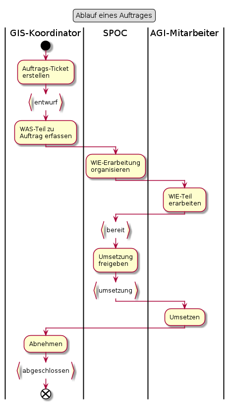

# Auftrag

## Punktuelle Erläuterungen
 
### "WIE-Erarbeitung organisieren" umfasst:
* Das "WAS" verstehen
* Sicherstellen, dass Ticket vollständig ist
* Überlegen, wer zeitnah das "WIE" erarbeiten kann

### "WIE-Teil erarbeiten" umfasst:
* **Möglichst einfache Lösung finden**
    * Gutes Verständnis des "WAS" erlangen. Nur so können geeignete Varianten formuliert werden.
    * Lösungsvarianten sammeln.
    * Mit GIS-Koordinator verhandeln (lassen), falls eine Anforderung eine einfache Lösung "gefühlt" verhindert.
* Gewählte Variante im Sinne der resultierenden Arbeiten strukturieren.
* "Kind-Tagesgeschäft-Tickets" erstellen
* "Admin-Arbeiten" identifizieren und mittels "Kind-Tagesgeschäft" mit Betrieb besprechen.

Falls es sich um einen Standardprozess handelt: Rad (natürlich) nicht neu erfinden,
sondern die notwendigen Arbeiten gemäss "Standardprozess" übernehmen.

### Umsetzen

Darin sind alle Arbeiten enthalten, für welche ein Tagesgeschäft-Ticket gelöst wurde.
Also auch die Arbeiten, welche ausschliesslich von den Admins (Betrieb) ausgeführt werden,

## Soll-Durchlaufzeiten

|Status von bis|Durchlaufzeit [at]|Bemerkungen|
|---|---|---|
|entwurf - bereit|5||
|bereit|1 - X|"Wartezeit". Ist stark abhängig von AGI-Auslastung. Bei hoher AGI-Auslastung externe Erarbeitung (erneut) prüfen.|
|bereit - abgeschlossen|7||

**Wichtig:** Bei hoher Auslastung ruht der Auftrag im Status "bereit", 
bei sehr hoher Auslastung auch schon vor der Erarbeitung des "WIE".
   

