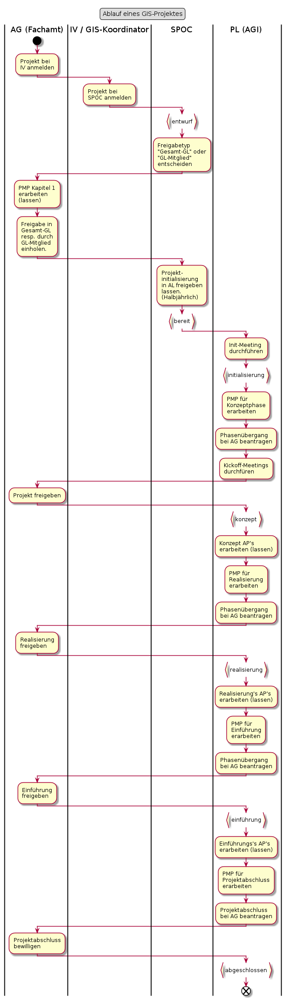
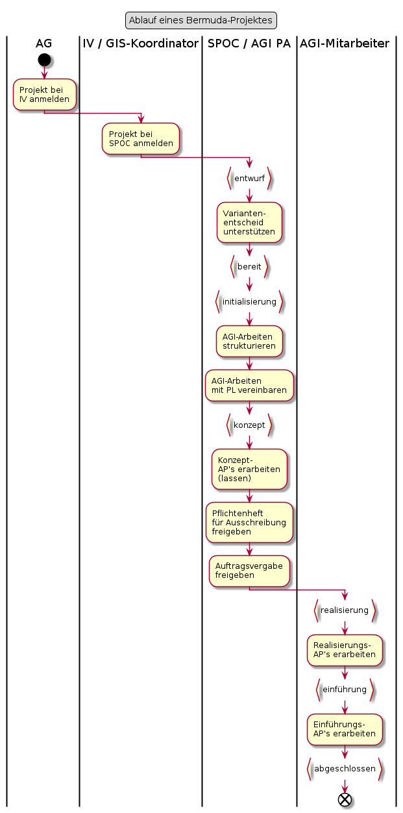

# GIS-Projekt mit Fachamt

## Punktuelle Erläuterungen zum Ablauf

### Init-Meeting durchführen

Zweck des Meetings:
* Kennenlernen der Projektbeteiligten in der Initialisierungsphase
* Rollenklärung
* Projektphasen vorstellen
* Arbeiten der Initialisierungsphase vorstellen und verteilen

### Kickoff-Meetings durchführen

Zweck der Meetings

Projektfreigabe-Meeting mit AG und PA:
* Projektfreigabe erhalten
* Details siehe [Entscheid zur Projektfreigabe treffen](https://www.hermes.admin.ch/bva/de/onlinepublikation/index.xhtml?element=aufgabe_entscheidzurprojektfreigabetreffen.html)

Projekt-Kickoff mit dem Projektteam
* Kennenlernen innerhalb Projektteam
* Rollenklärung
* Projekt und dessen Phasen vorstellen
* Arbeiten der Konzeptphase vorstellen und verteilen

# Bermuda-Projekt mit Fachamt

Trio: Im IT-Budget des AIO eingestelltes Projekt, mit Projektleitung im Fachamt
und GIS-Anforderungen. Häufig geht es um die Beschaffung einer Fachapplikation,
welche die Schnittstellen der Geodateninfrastruktur zur Integration von Karten-
funktionalitäten nutzt.

In dieser Konstellation liegt die Projektleitung beim Fachamt. Das AGI ist im Projekt strategisch vertreten:
* Vor der Konzeptphase durch den SPOC
* Ab der Konzeptphase durch den AGI-Vertreter im Projektausschuss (Typischerweise Leiter AGI oder SPOC)

Es wird seitens AGI kein Projektleiter gestellt, da:
* Es um Anbindungen an bestehende Schnittstellen der GDI geht, und dies operativ gut durch ein AGI-Mitarbeiter geleistet werden kann. 
* Aus Sicht AGI in einem Projekt genau ein Projektleiter gestellt werden sollte, welcher das Projekt führt.

Im Diagramm sind ergänzend zum Projektablauf des AIO die AGI-Aspekte abgebildet. Die sehr wichtigen Leitlinien
zu Beispielsweise den Phasenübergängen und der Projektorganisation sind selbstverständlich mit gemeint.

## Punktuelle Erläuterungen zum Ablauf

### Variantenentscheid unterstützen

Teilweise besteht die Herausforderung, dass die Angebote des AGI noch nicht richtig in den Fachämtern angekommen sind. 
In der Initialisierungsphase werden wegweisende Informationen generiert. Darauf basierend werden Varianten abgewogen
und der Entscheid für eine Variante gefällt.
Das AGI verfügt über vertiefte Kompetenzen bezüglich (Geo-)Informatik und Projektmanagement. Diese Kompetenzen 
werden in der wichtigen Initialisierungsphase aktiv in das Projekt eingebracht.

### AGI-Arbeiten mit PL vereinbaren

Mit PL die Arbeiten des AGI durchgehen und damit den Arbeitsumfang und -charakter des AGI im Projekt vereinbaren.
Der PL muss die Arbeitspakete des AGI für das Projekt verstehen und im Gesamtprojektrahmen einordnen können.

# AGI-internes Projekt

Liegt vor, wenn
* Das Vorhaben grösser und oder komplexer ist wie ein Auftrag
* Wir vom AIO keine oder ausschliesslich Standarddienstleistungen benötigen
* Es sich für das AIO um eine Versionsaktualisierung handelt.

Ist bei möglichen Schnittstellen des Projektes mit dem AIO jeweils vom KAM zu bestätigen.

  
