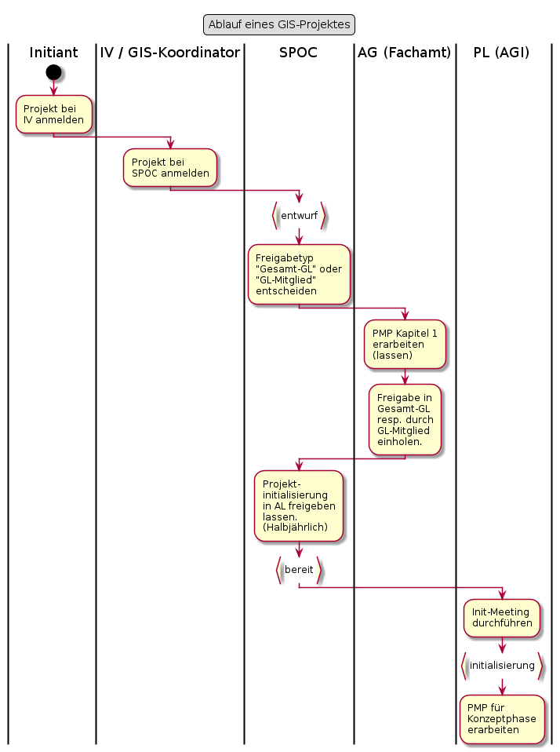
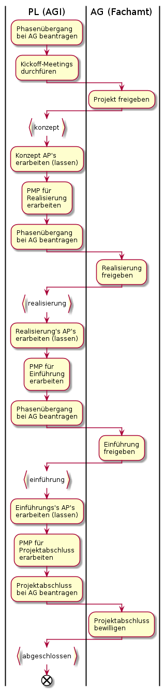
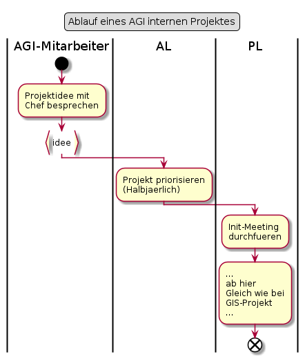

# GIS-Projekt mit Fachamt

## Projekt-Initialisierung

### Punktuelle Erläuterungen zum Ablauf

#### PMP Kapitel 1 erarbeiten (lassen)

Spätestens hier kommt der designierte Auftraggeber ins Spiel. Dieser ist wichtig:
* Um das Mehr-Augen-Prinzip im Fachamt sicherzustellen
* "Moderierte" fachliche Ziele zu gewährleisten (Unterscheidung, was wirklich notwendig, und was "nice to have" ist)

Der Initiant (Bedürftnisträger) sollte in der Regel nicht der Auftraggeber sein. 
Der Auftraggeber muss in der Lage sein, die Interessen aller Projektbeteiligten auszugleichen.
Dies ist in der Regel als primärer Bedürftnisgträger schwierig. 

#### Init-Meeting durchführen

Zweck des Meetings:
* Kennenlernen der Beteiligten in der Initialisierungsphase
* Rollenklärung für Initialisierungsphase (Projektorganisation steht noch nicht)
* Arbeiten der Initialisierungsphase vorstellen und verteilen

## Projekt-Umsetzung

### Punktuelle Erläuterungen zum Ablauf

#### Kickoff-Meetings durchführen

Zweck der Meetings:

Projektfreigabe-Meeting mit AG und PA:
* Projektfreigabe erhalten
* Details siehe [Entscheid zur Projektfreigabe treffen](https://www.hermes.admin.ch/bva/de/onlinepublikation/index.xhtml?element=aufgabe_entscheidzurprojektfreigabetreffen.html)

Projekt-Kickoff mit dem Projektteam:
* Kennenlernen innerhalb Projektteam (Ohne AG, PA)
* Rollenklärung - wer macht was im Projekt?
* Projekt und dessen Phasen vorstellen
* Arbeiten der Konzeptphase vorstellen und verteilen

# Von AGI initiiertes Projekt

Liegt vor, wenn das Vorhaben grösser und oder komplexer ist wie ein Auftrag

## Punktuelle Erläuterungen zum Ablauf

### Hauptbetroffene klären (lassen)

Ziele:
* Entscheiden, welche Organsiationseinheiten am Init-Meeting vertreten sein müssen.
* Insbesondere die Betroffenheit des AIO mit KAM klären. Mögliche Fragen zur Klärung:
    * Braucht es vom AIO Dienstleistungen?
    * Braucht es ausschliesslich Standarddienstleistungen?
    * Betrachtet das AIO das Vorhaben als Versionsaktualisierung?

Abhängig von den Antworten auf diese Fragen muss beim AIO ein Projekt eingestellt werden oder nicht.

**BEACHTEN:** Projekteinstellung muss bis Februar im alten Jahr erfolgen, damit das Kickoff im neuen Jahr stattfinden kann.
Bei angespannter AIO-Ressourcenlage kann sogar das Init-Meeting erst im neuen Jahr stattfinden.

  
