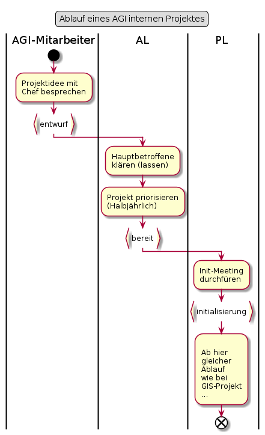

# GIS-Projekt mit Fachamt

## Punktuelle Erläuterungen zum Ablauf

### Init-Meeting durchführen

Zweck des Meetings:
* Kennenlernen der Projektbeteiligten in der Initialisierungsphase
* Rollenklärung
* Projektphasen vorstellen
* Arbeiten der Initialisierungsphase vorstellen und verteilen

### Kickoff-Meetings durchführen

Zweck der Meetings

Projektfreigabe-Meeting mit AG und PA:
* Projektfreigabe erhalten
* Details siehe [Entscheid zur Projektfreigabe treffen](https://www.hermes.admin.ch/bva/de/onlinepublikation/index.xhtml?element=aufgabe_entscheidzurprojektfreigabetreffen.html)

Projekt-Kickoff mit dem Projektteam
* Kennenlernen innerhalb Projektteam
* Rollenklärung
* Projekt und dessen Phasen vorstellen
* Arbeiten der Konzeptphase vorstellen und verteilen

# AGI-internes Projekt

Liegt vor, wenn
* Das Vorhaben grösser und oder komplexer ist wie ein Auftrag
* Wir vom AIO keine oder ausschliesslich Standarddienstleistungen benötigen
* Es sich für das AIO um eine Versionsaktualisierung handelt.

Ist bei möglichen Schnittstellen des Projektes mit dem AIO jeweils vom KAM zu bestätigen.

  
