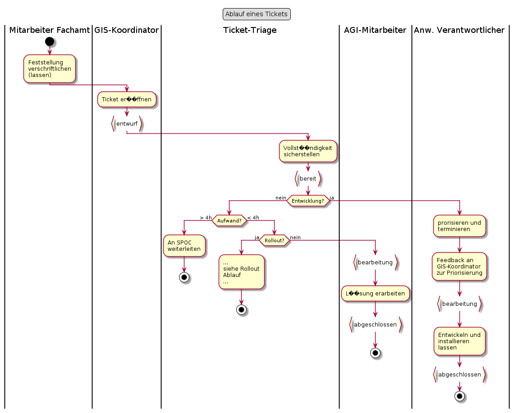
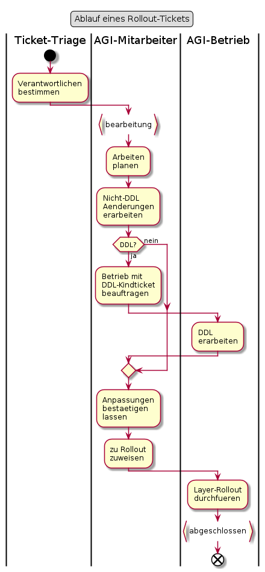

# Tagesgeschäft

## SOLL-Durchlaufzeiten

Bemerkung: Ein Tagesgeschäft kann auch eine sehr grosse Durchlaufzeit haben, wenn dieses Beispielsweise
eine Codeänderung (Software-Entwicklung) auslöst. Darum sind folgend nur die Durchlaufzeiten für
Tickets aufgeführt, welche weder einem Release noch einem Rollout zugewiesen sind.

|Status von bis|Durchlaufzeit [at]|Bemerkungen|
|---|---|---|
|entwurf - bereit|3||
|bereit - umsetzung|1 - 5|"Wartezeit". Ist stark abhängig von AGI-Auslastung|
|umsetzung - abgeschlossen|1||

**Wichtig:** Bei hoher Auslastung ruht das Ticket im Status "bereit"

# Rollout-Ticket

## Bemerkungen

### Schritt "Arbeiten planen"

Dies ist ein wichtiger Schritt, um den stressfreien Erfolg der Änderung sicherzustellen. Wichtige Fragen in der Planung:
* SPOC informieren, falls die Änderung viel Aufwand auslöst und mir der fachliche
Nutzen nicht klar ist.
* Gibt es strukturelle Anpassungen?
    * DDL?
    * Anpassungen an Codelisten?
* Welche Daten und Applikationen sind vom Datensatz abhängig?
    * Werden sie von der Änderung betroffen sein?
* Wer erarbeitet mir das DDL? Bis wann muss dieses stehen?
* In welchen Rollout "möchte ich rein"?
* Wann muss ich es spätestens dem SPOC vorlegen, damit es auch mit allfälligen
Korrekturen noch in den Rollout passt?