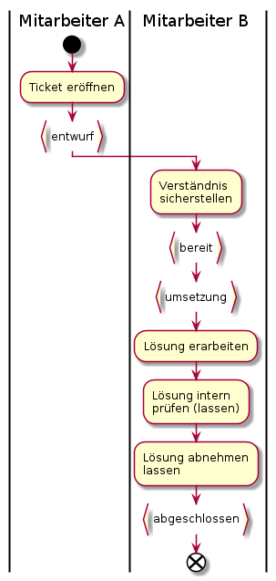

# Tagesgeschäft

## SOLL-Durchlaufzeiten

Bemerkung: Ein Tagesgeschäft kann auch eine sehr grosse Durchlaufzeit haben, wenn dieses Beispielsweise
eine Codeänderung (Software-Entwicklung) auslöst. Darum sind folgend nur die Durchlaufzeiten für
Tickets aufgeführt, welche keinem Rollout zugewiesen sind.

|Status von bis|Durchlaufzeit [at]|Bemerkungen|
|---|---|---|
|entwurf - bereit|3||
|bereit - umsetzung|1 - 5|"Wartezeit". Ist stark abhängig von AGI-Auslastung|
|bearbeitung - abgeschlossen|1||

**Wichtig:** Bei hoher Auslastung ruht das Ticket im Status "bereit"

## Rollout-Ticket

