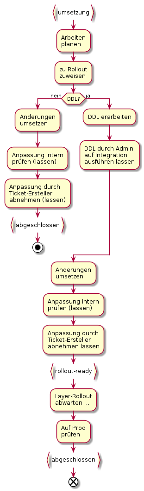

# Tagesgeschäft

Ein Vorhaben der Schuhgrösse "Tagesgeschäft" kann seinen Ursprung AGI-Intern, in den Fachämtern oder im AIO haben.

In jedem Fall ist wichtig, gleich am Anfang die Schuhgrösse zu Hinterfragen, und ein Auftrag oder Projekt zu wählen,
wenn es die vom Vorhaben ausgelöste Komplexität und oder der ausgelöste Arbeitsaufwand erfordert.

Die Verantwortung für die Wahl der passenden Schuhgrösse liegt bei demjenigen, welcher den Status eines Vorhabens
von "Entwurf" auf "Bereit" setzt.

## Basisablauf bei AGI-internem Ticket-Ersteller

Falls keinem Rollout zugewiesen und von überschaubarer Komplexität und Umfang, 
wird die Arbeit mittels "Tagesgeschäfts-Ticket" abgewickelt.

## Ticket-Triage

Anfragen von Fachstellen können unterschiedlichste Arbeiten auslösen. Mittels Ticket-Triage werden die Tickets
klassiert und auf den richtigen Weg geschickt.

## Bemerkungen zu einzelnen Schritten

### Entscheid "Geodaten-bezogen?"

Geodaten-bezogen bedeutet, dass entweder eine Anpassung der Ausgabe der Geodaten gewünscht ist, oder
eine Anpassung an den Geodaten selbst. Die Anpassung der Ausgabe bezieht sich häufig auf die Konfiguration 
im Web GIS Client, eine Anpassung der Geodaten bedingt häufig eine Modelländerung.

Nicht "Geodaten-bezogen" sind beispielsweise:
* Bug's einer funktionalen Einheit
* Weiterentwicklungswünsche bezüglich einer funktionalen Einheit
* Konfigurationsanpassungen an Komponenten der funktionalen Einheit

### Entscheid "FE-bezogen?"

FE = Funktionale Einheit.

* Zutreffend (Ja), falls sich die Anfrage auf eine einzige funktionale Einheit bezieht.
* Nicht zutreffend (Nein), falls sich die Anfrage auf keine oder mehrere funktionale Einheiten bezieht.
Bei Betroffenheit mehrerer funktionaler Einheiten organisiert der GDI-Koordinator eine Besprechung mit
den betroffenen Anwendungsverantwortlichen zwecks Projekt-Initialisierung.

### Entscheid "bleibt Tagesgeschäft?"

Wird in der Besprechung mit dem SPOC ermittelt. Wichtige, aber nicht einzige Entscheidungskriterien:
* Wie hoch ist der Umsetzungsaufwand?
* Ist die Anfrage etwas "bekanntes", was schon mehrere Male gemacht wurde, oder etwas neues?

## SOLL-Durchlaufzeiten

Bemerkung: Ein Tagesgeschäft kann auch eine sehr grosse Durchlaufzeit haben, wenn dieses Beispielsweise
eine Codeänderung (Software-Entwicklung) auslöst. Darum sind folgend nur die Durchlaufzeiten für
Tickets aufgeführt, welche weder einem Release noch einem Rollout zugewiesen sind.

|Status von bis|Durchlaufzeit [at]|Bemerkungen|
|---|---|---|
|entwurf - bereit|3||
|bereit - umsetzung|1 - 5|"Wartezeit". Ist stark abhängig von AGI-Auslastung|
|umsetzung - abgeschlossen|1||

**Wichtig:** Bei hoher Auslastung ruht das Ticket im Status "bereit"

# Rollout-Ticket

## Bemerkungen

### Schritt "Arbeiten planen"

Dies ist ein wichtiger Schritt, um den stressfreien Erfolg der Änderung sicherzustellen. Wichtige Fragen in der Planung:
* Gibt es strukturelle Anpassungen?
    * DDL?
    * Anpassungen an Codelisten?
* Welche Daten und Applikationen sind vom Datensatz abhängig?
    * Werden sie von der Änderung betroffen sein?
* In welchen Rollout "möchte ich rein"?
* Wann muss ich es spätestens dem Ticket-Ersteller vorlegen, damit es auch mit allfälligen
Korrekturen noch in den Rollout passt?

### Entscheidung "DDL?"

Falls die Anpassung Modelländerungen und oder Berechtigungsänderungen umfasst,
müssen diese an einen Admin zur Durchführung auf der Integration übergeben werden.
Zusätzlich muss sichergestellt werden, dass im Layer-Rollout auf der Prod
dasselbe Skript nochmals durchgeführt wird.

Änderungen ohne DDL können einfach und selbstständig durchgeführt 
und abgeschlossen werden.

Änderungen mit DDL brauchen mehr Aufmerksamkeit. Im Gegensatz zu den 
"Nicht-DDL"-Änderungen müssen diese nach dem "Go-Live" erneut geprüft 
werden.

### Schritt "DDL durch Admin auf Integration ausführen lassen"

Dazu ein Kindticket erstellen und einem Admin zuweisen. 

Das Hauptticket, und damit **die Verantwortung** bezüglich des 
termingerechte Abschluss aller notwendigen Arbeiten **bleibt beim AGI-Mitarbeiter**. Dieser muss im Schritt "Arbeit planen"
ein entsprechendes Zeitfenster für das Ausführen der DDL's auf der Integration einplanen. 

### Schritt "Anpassung intern prüfen (lassen)"

Eine im AGI erstellte Anpassung / Lösung muss in jedem Fall zuerst AGI-intern sauber getestet werden.
Am effizientesten ist es, wenn der Bearbeiter dies gleich selber erledigt. Wem dies nicht möglich erscheint, 
bittet einen Arbeitskollegen zu testen.

**Wichtig:** Die Verantwortung, dass gut und zeitnah getestet und abgeschlossen wird, bleibt beim Bearbeiter.
Das Ticket wird **nicht** an den Tester übergeben.

### Schritt "Layer-Rollout abwarten ..."

Das Ticket bleibt beim bearbeitenden Mitarbeiter. Nachdem der Layer-Rollout durchgeführt wurde, erfolgt 
die Endkontrolle auf der Produktion.