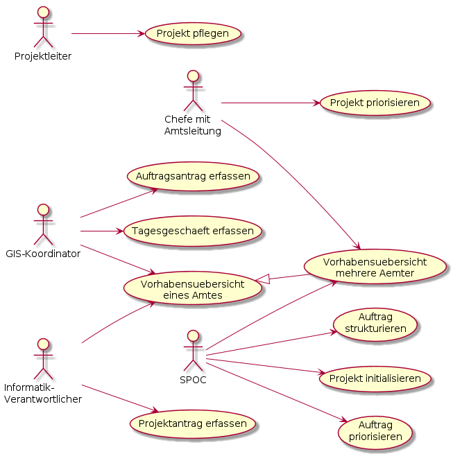
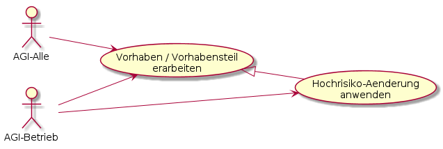

Erläuterungen zu den Anwendungsfällen jeweils top-down geordnet gemäss Diagramm.

# Anwendungsfälle Subsysteme

## Releasegebundene Anpassung definieren

Anforderung(en) in Ticket erfassen und beschreiben, welche die Weiterentwicklung des Subsystems bedingen.

## Ungebundene Anpassung / Stoerung definieren

Ticket zu Konfigurationsanpassung / Stoerungsbehebung erfassen.

## Endanwenderanforderung definieren / priorisieren

Erfassen und priorisieren von Anforderungen der Endanwender der GDI

## Release als Projekt beantragen

Beantragen des Release mit:
* Vorstellung der geplanten Neuerungen
* Abwägung Kosten Nutzen
* Antwort auf Frage: Wieso jetzt?

## Betriebsanforderung definieren / priorisieren

Definition eines Weiterentwicklungs-Tickets bezüglich einer nicht erfüllten Betriebsanforderung. Beispiele:
* Logging unübersichtlich
* Schlechte Trennung zwischen Applikations-Konfiguration und Environment-Variablen
* Docker Image ist "nicht gut" (Ressourcenfresser, instabil, ...)
* Betriebsdokumentation braucht Verbesserung

# Anwendungsfälle Koordination

## Projekt pflegen

Umfasst:
* Projekt eröffnen
* Projektinformationen pflegen
* Projekt abschliessen

## Projekt priorisieren

Priorisierung der eingegangenen Projekte - Wird meist 2 mal im Jahr gemacht.

## Auftragsantrag erfassen

Auftrag kurz mit SPOC besprechen und Auftrags-Ticket eröffnen.

## Tagesgeschäft erfassen

Ticket eröffnen und Sachverhalt nachvollziehbar beschreiben

## Vorhabensübersicht eines Amtes

Ansicht umfasst alle nicht abgeschlossenen Vorhaben eines Amtes

## Vorhabensübersicht mehrere Ämter

Übersicht der Vorhaben mehrerer Ämter anzeigen. Sehr wahrscheinlich Projekte und Aufträge in einer Ansicht, 
Tagesgeschäfte in einer weiteren (oder erweiterten) Ansicht.

Gemeinsame Status aller Vorhaben:
* **Pendent:** Vorhaben ist "am Horizont", es finden aber noch keine Arbeiten statt. Bei einem Projekt entspricht dies in etwa
dem Projektantrag.
* **In Arbeit:** Vorhaben wird erarbeitet
* **Abgeschlossen:** Alle Arbeiten des Vorhabens sind abgeschlossen

Übersicht der Status nach Vorhabenstyp:

|Projekt|Auftrag|Tagesgeschäft / Ticket|
|---|---|---|
|Pendent|Pendent|Pendent|
|Initialisierung|Konzept|In Arbeit|
|Konzept|Konzept|In Arbeit|
|Realisierung|Realisierung|In Arbeit|
|Einführung|Realisierung|In Arbeit|
|Abgeschlossen|Abgeschlossen|Abgeschlossen|

Bei den Tickets zu einem Rollout und einem Subsystem muss in geeigneter weise das Rolloutdatum respektive die Version
zugeordnet werden können.

## Auftrag strukturieren

* Umsetzungsvarianten finden
* Variantenentscheid herbeiführen
* Falls Auftrag mehrere Tickets umfasst: In Ticketsystem entsprechend strukturieren.

## Projekt initialisieren

Gemeinsam mit Auftraggeber und "designiertem" Projektleiter
* Ziele klären
* Hauptvarianten zur Zielerreichung finden
* Projektorganisation definieren
* Spätestens mit Phasenübergang in die Konzeptphase: Projekt an PL übergeben.

## Auftrag priorisieren

Priorisierung der Aufträge untereinander

## Projektantrag erfassen

Projekt mit SPOC kurz besprechen und anschliessend Antrag erfassen

# Anwendungsfälle Erarbeitung

## Vorhaben / Vorhabensteil erarbeiten

Erarbeiten des ganzen Vorhabens oder von Teilen davon, mit Dokumentation im Ticketsystem sobald abgeschlossen.

## Hochrisiko-Aenderung anwenden

Beispiele für Hochrisiko-Änderungen:
* Versionsaktualisierungen von WGC, QGIS Desktop, QGIS Server, DB, 
* Schemaänderungen von vielfältig referenzierten Basisdatensätzen, wie zum Beispiel der Adressen
* Anpassung an schemaübergreifenden Suchkonfigurationen

Die Versionsaktualisierungen werden in Projekten oder Aufträgen abgewickelt

   
